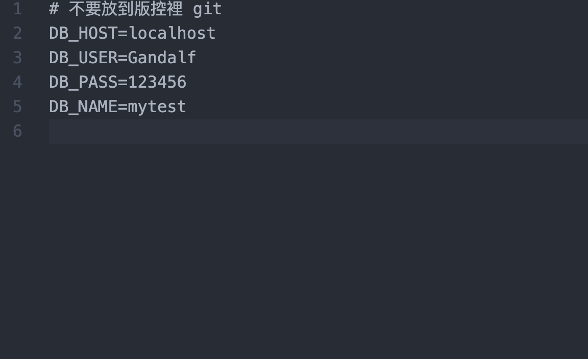
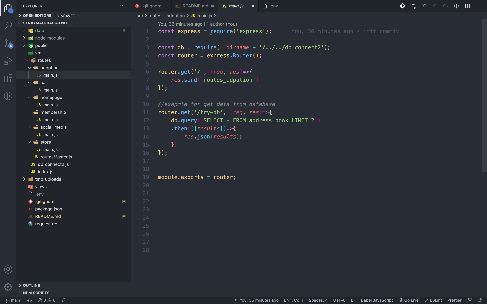

# StrayMao-back-end

---

### How to install

1. clone the repository

```
git clone https://github.com/tsun-yu/StrayMao-back-end.git
```

2. goto repository

```
cd StrayMao-back-end
```

3. install node_module

```
npm i
```

4. create a .env file
5. set up .env file to link database
```
DB_HOST= // *Write your db host*
DB_USER= // Your Account
DB_PASS= // Your Password
DB_NAME= // DB name
```
 


6. Now you can run node server and try to link <http://localhost:3001/straymao/>
you'll see somemessage like "there is route master" 
7. Watch your file directory

main.js is the place where you should code your own function here!
